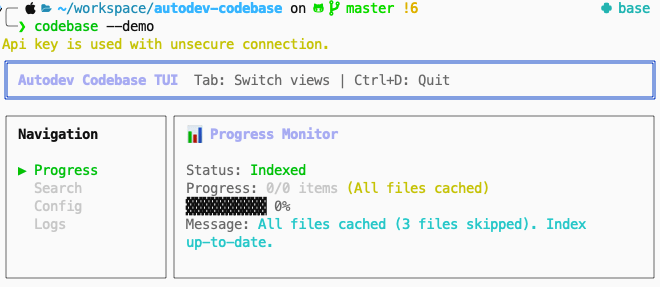
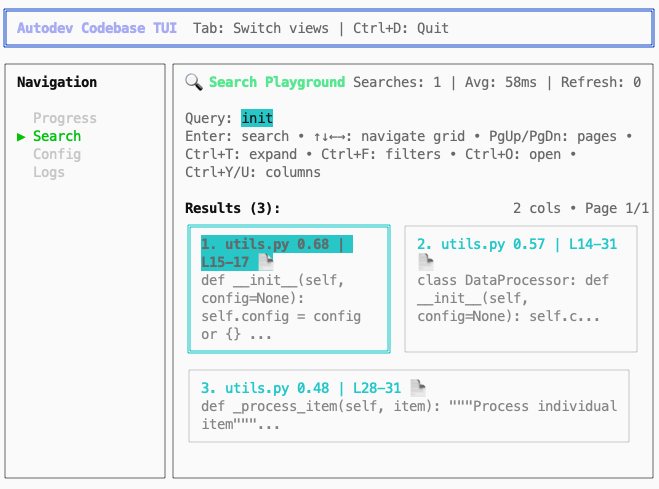
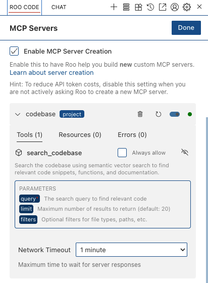

# @autodev/codebase

<div align="center">
  
  
  
</div>

<br />

A platform-agnostic code analysis library with semantic search capabilities and MCP (Model Context Protocol) server support. This library provides intelligent code indexing, vector-based semantic search, and can be integrated into various development tools and IDEs.

## 🚀 Features

- **Semantic Code Search**: Vector-based code search using embeddings
- **MCP Server Support**: HTTP-based MCP server for IDE integration
- **Terminal UI**: Interactive CLI with rich terminal interface
- **Tree-sitter Parsing**: Advanced code parsing and analysis
- **Vector Storage**: Qdrant vector database integration
- **Flexible Embedding**: Support for various embedding models via Ollama

## 📦 Installation

### 1. Install and Start Ollama

```bash
# Install Ollama (macOS)
brew install ollama

# Start Ollama service
ollama serve

# In a new terminal, pull the embedding model
ollama pull nomic-embed-text
```

### 2. Install and Start Qdrant

Start Qdrant using Docker:

```bash
# Start Qdrant container
docker run -p 6333:6333 -p 6334:6334 qdrant/qdrant
```

Or download and run Qdrant directly:

```bash
# Download and run Qdrant
wget https://github.com/qdrant/qdrant/releases/latest/download/qdrant-x86_64-unknown-linux-gnu.tar.gz
tar -xzf qdrant-x86_64-unknown-linux-gnu.tar.gz
./qdrant
```

### 3. Verify Services Are Running

```bash
# Check Ollama
curl http://localhost:11434/api/tags

# Check Qdrant
curl http://localhost:6333/collections
```
### 4. Install project locally

```
git clone https://github.com/anrgct/autodev-codebase
cd autodev-codebase
npm install
npm run build
npm link
```
## 🛠️ Usage

### Command Line Interface

The CLI provides two main modes:

#### 1. Interactive TUI Mode (Default)
```bash
# Basic usage: index your current folder as the codebase.
# Be cautious when running this command if you have a large number of files.
codebase


# With custom options
codebase --demo # Create a local demo directory and test the indexing service, recommend for setup
codebase --path=/my/project
codebase --path=/my/project --log-level=info
```

#### 2. MCP Server Mode (Recommended for IDE Integration)
```bash
# Start long-running MCP server
cd /my/project
codebase mcp-server

# With custom configuration
codebase mcp-server --port=3001 --host=localhost
codebase mcp-server --path=/workspace --port=3002
```

### IDE Integration (Cursor/Claude)

Configure your IDE to connect to the MCP server:

```json
{
  "mcpServers": {
    "codebase": {
      "url": "http://localhost:3001/sse"
    }
  }
}
```

For clients that do not support SSE MCP, you can use the following configuration:

```json
{
  "mcpServers": {
    "codebase": {
      "command": "codebase",
      "args": [
        "stdio-adapter",
        "--server-url=http://localhost:3001/sse"
      ]
    }
  }
}
```

### Library Usage

#### Node.js Usage
```typescript
import { createNodeDependencies } from '@autodev/codebase/adapters/nodejs'
import { CodeIndexManager } from '@autodev/codebase'

const deps = createNodeDependencies({ 
  workspacePath: '/path/to/project',
  storageOptions: { /* ... */ },
  loggerOptions: { /* ... */ },
  configOptions: { /* ... */ }
})

const manager = CodeIndexManager.getInstance(deps)
await manager.initialize()
await manager.startIndexing()
```

## 🔧 CLI Options

### Global Options
- `--path=<path>` - Workspace path (default: current directory)
- `--demo` - Create demo files in workspace
- `--ollama-url=<url>` - Ollama API URL (default: http://localhost:11434)
- `--qdrant-url=<url>` - Qdrant vector DB URL (default: http://localhost:6333)
- `--model=<model>` - Embedding model (default: nomic-embed-text)
- `--config=<path>` - Config file path
- `--storage=<path>` - Storage directory path
- `--cache=<path>` - Cache directory path
- `--log-level=<level>` - Log level: error|warn|info|debug (default: error)
- `--help, -h` - Show help

### MCP Server Options
- `--port=<port>` - HTTP server port (default: 3001)
- `--host=<host>` - HTTP server host (default: localhost)

## 🌐 MCP Server Features

### Web Interface
- **Home Page**: `http://localhost:3001` - Server status and configuration
- **Health Check**: `http://localhost:3001/health` - JSON status endpoint
- **MCP Endpoint**: `http://localhost:3001/sse` - SSE/HTTP MCP protocol endpoint

### Available MCP Tools
- **`search_codebase`** - Semantic search through your codebase
  - Parameters: `query` (string), `limit` (number), `filters` (object)
  - Returns: Formatted search results with file paths, scores, and code blocks
- **`get_search_stats`** - Get indexing status and statistics
- **`configure_search`** - Configure search parameters at runtime


### Scripts
```bash
# Development mode with demo files
npm run dev

# Build for production
npm run build

# Type checking
npm run type-check

# Run TUI demo
npm run demo-tui

# Start MCP server demo
npm run mcp-server
```

## 💡 Why Use MCP Server Mode?

### Problems Solved
- **❌ Repeated Indexing**: Every IDE connection re-indexes, wasting time and resources
- **❌ Complex Configuration**: Each project needs different path parameters in IDE
- **❌ Resource Waste**: Multiple IDE windows start multiple server instances

### Benefits
- **✅ One-time Indexing**: Server runs long-term, index persists
- **✅ Simplified Configuration**: Universal IDE configuration, no project-specific paths
- **✅ Resource Efficiency**: One server instance per project
- **✅ Better Developer Experience**: Start server in project directory intuitively
- **✅ Backward Compatible**: Still supports traditional per-connection mode
- **✅ Web Interface**: Status monitoring and configuration help
- **✅ Dual Mode**: Can run both TUI and MCP server simultaneously


This is a platform-agnostic library extracted from the roo-code VSCode plugin. 
## 📚 Examples

See the `examples/` directory for complete usage examples:
- `nodejs-usage.ts` - Node.js integration examples
- `run-demo-tui.tsx` - TUI demo application